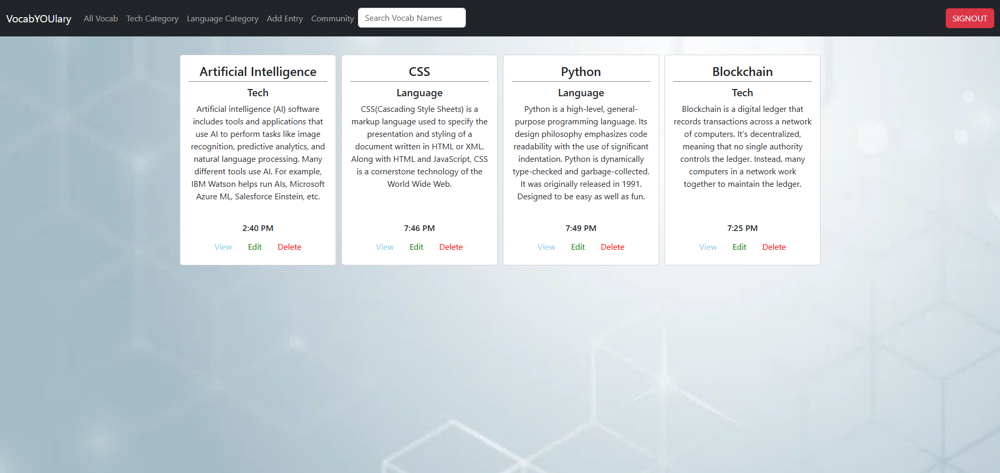

# Q2 - Individual Assessment: Vocab-YOU-lary

# Name and Overview

VocabYOUlary is the name of the project. An overview of the project is my application lets all users perform full CRUD with their own unique Tech and Language Cards. You can filter through the Tech and Language cards and also search up a specific card!

# ERD

()

# Netlify Deploy Link

(https://app.netlify.com/sites/vocablanguagesandtech/overview)

# Project Board Link

(https://github.com/users/mattnorthcutt/projects/1/views/2)

# Desc of User and Problem 

If a user wants to make tech and language Vocab Cards they can use this application as a tool to help them with their needs!

# Features List

Users can Log in with your own Google Account
Users can Create, Delete, Update, and Read their own vocab cards.
Users can filter through their tech and language cards to get only a specific category they want
Users can search up a specific vocab card they want
Users can log out and log back in with a different account and make different tech and language cards if they desire
It is all user specific
Users can view edit and delete any card they want

# Screenshot of Project

()

# List of contributors(GitHub Profiles)

(https://github.com/mattnorthcutt)

# Loom Video

(https://www.loom.com/share/368498eeefd84cbdbd51089c1b143527)
